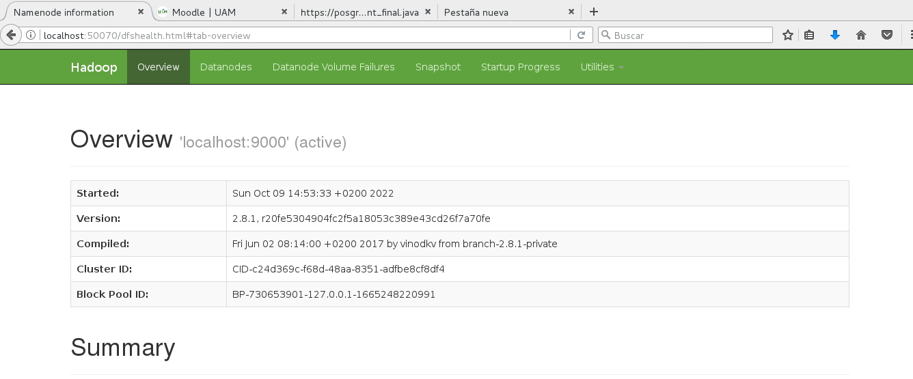
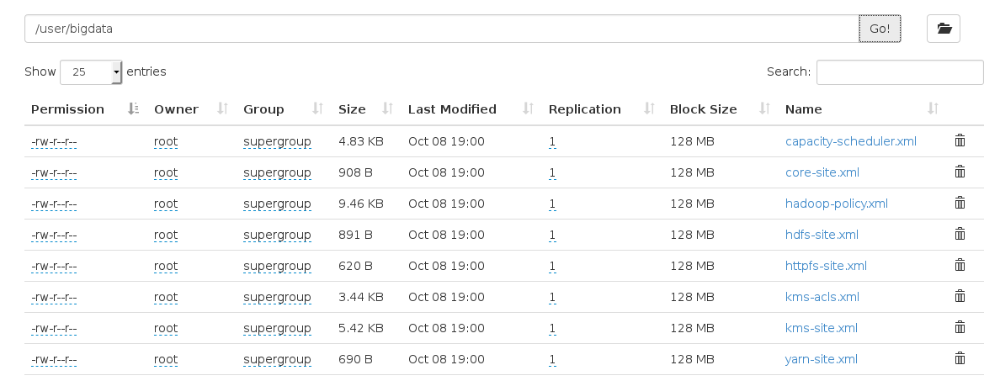
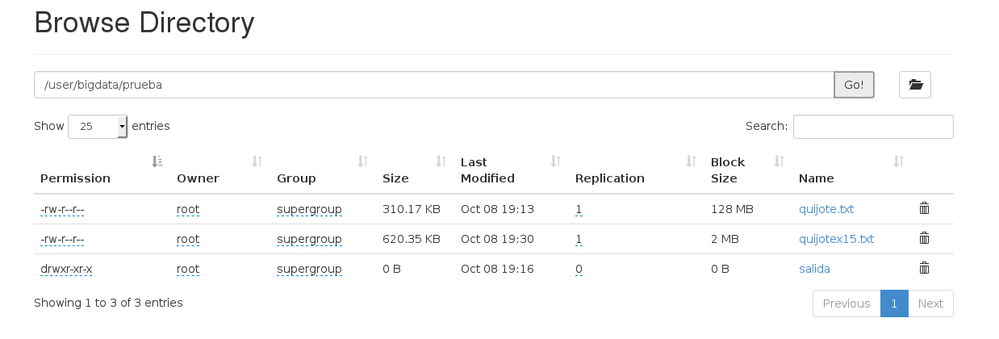

---
title: "Práctica 1. Hadoop y Spark"
author: [Blanca Cano Camarero y Iker Villegas Labairu]
date: "Madrid 8 de octubre del 2022"
subject: "Procesamiento de datos a gran escala"
keywords: [Hadoop, Spark]
subtitle: ""
lang: "es"
titlepage: true,
titlepage-text-color: "FFFFFF"
titlepage-rule-color: "360049"
titlepage-rule-height: 0
titlepage-background: "background.pdf"
...

\newpage

# Práctica 1 Hadoop y Spark

## 1. Instalación de Hadoop

Para la instalación se ha seguido estrictamente el tutorial de clase, además para agilizar el proceso y puesto que en ambiente actual es interesante el uso de contenedores, hemos realizado un script de bash, para automatizar el proceso de instalación hasta la parte de ssh en un contenedor de docker con `CentOS:7`: 


```bash
echo "Task 1: Updating system"
yum -y update && yum clean all
echo "Task 2: Installing packages"
yum -y install wget
yum -y install which
yum -y install rsync
yum -y install java-1.7.0-openjdk
echo "Task 3: Hadoop installation (may take a while)"
wget https://archive.apache.org/dist/hadoop/common/hadoop-2.8.1/hadoop-2.8.1.tar.gz
tar xvzf hadoop-2.8.1.tar.gz
mv hadoop-2.8.1 opt/
cd opt/ && ln -s hadoop-2.8.1 hadoop
export JAVA_HOME=/usr/lib/jvm/jre-1.7.0-openjdk
echo 'export JAVA_HOME=/usr/lib/jvm/jre-1.7.0-openjdk' >> ./hadoop/etc/hadoop/hadoop-env.sh
# Comando de prueba
#./opt/hadoop/bin/hadoop 

yum -y install openssh-server openssh-clients
```

El respectivo Dockerfile sería el siguiente: 

```Dockerfile
FROM centos:7
COPY ./initial.sh /
COPY ./material /
RUN bash ./initial.sh
EXPOSE 50070
```

Donde la carpeta material contiene: 
```shell
(main)> tree material/                                                                          
material/
|--WordCount_final.java
|-- quijote.txt
```

Para llevar a cabo la instalación de hadoop se han llevado a cabo los siguientes requisitos:
 - En primer lugar, hemos instalado la versión 1.7 de java en OpenJDK la cual ya viene con CentOS.
``` yum -y install java-1.7.0-openjdk```
-Por otro lado, también se ha instalado el paquete `rsync`, el cual está incluido en Linux.
```yum -y install rsync```
-Por último, hemos obtenido hadoop a través del siguiente modo:
```wget apacha.rediris.es/hadoop/common/hadoop-2.8.1/hadoop-2.8.1.tar.gz```
Una vez llevado a cabo estos puntos hemos descomprimido el archivo `hadoop-2.8.1.tar.gz` y lo hemos movido a la carpeta `/opt`. Para finalizar se ha llevado una modificación en el fichero `/opt/hadoop/etc/hadoop/hadoop-env.sh` a través del comando `vim`, donde el código `export JAVA_HOME=${JAVA_HOME}` ha pasado a ser `export JAVA_HOME=/usr/lib/jvm/jre-1.7.0-openjdk`.
A continuación, hemos clonado la máquina virtual para llevar a cabo dicha instalación de dos formas distintas: Standalone y pseudo-distributed.
Comenzamos con el modo standalone. Para ello llevaremos a cabo el siguiente ejemplo.
Desde la carpeta `/opt/hadoop`, creamos un directorio al que llamaremos `prueba` y lo rellenamos con los datos.
```cp etc/hadoop/*.xml prueba```
Y ejecutamos el comando siguiente 
```bin/hadoop jar share/hadoop/tools/lib/hadoop-streaming-2.8.1.jar -input prueba -output salida -mapper cat -reducer wc```
Obteniendo así la siguiente salida:  757    2803   27305

Pasamos ahora al caso donde la instalación se ha llevado a cabo en modo pseudo-distributed.
Aquí, hemos comenzado configurando el `ssh` de la siguiente forma para que funcione sin contraseña con conexiones en localhost:

```
ssh-keygen
ssh-copy-id localhost
```
A continuación, hemos modificado los siguientes ficheros a través del comando `vim`:
-`/opt/hadoop/etc/hadoop/core-site.xml`, donde se ha llevado a cabo la modificación
```
<configuration>
        <property>
                <name>fs.defaultFS</name>
                <value>hdfs://localhost:9000</value>
        </property>
</configuration>
```
-`/opt/hadoop/etc/hadoop/core-site.xml`, en el cual hemos cambiado lo siguiente
```
<configuration>
        <property>
                <name>dfs.replication</name>
                <value>1</value>
        </property>
</configuration>

```
Para finalizar hemos formateado el sistema de ficheros y hemos iniciado el NameNode y DataNode de la forma siguiente:
```
/opt/hadoop/bin/hdfs namenode -format
/opt/hadoop/sbin/start-dfs.sh
```
Comprobamos que Podemos acceder a la web del NameNode a través del siguiente enlace: http://localhost:50070.


Para corroborar su funcionamiento hemos creado los siguientes directorios en HDFS desde la carpeta hadoop:
```
bin/hdfs dfs -mkdir /user
bin/hdfs dfs -mkdir /user/root
bin/hdfs dfs -mkdir /user/bigdata
bin/hdfs dfs -mkdir /user/bigdata/prueba
```
Y hemos ejecutado el siguiente código para copiar los archivos de extensión .xml situados en la carpeta `etc/hadoop` al directorio `/user/bigdata`
```
bin/hdfs dfs -put etc/hadoop/*.xml /user/bigdata
```
Se plantean las siguientes cuestiones:

### ¿En qué directorio del HDFS se copian los ficheros?

Los ficheros se copian en el directorio `/user/bigdata`, tal y como se había indicado en el comando anterior.



### ¿Qué ocurre si no hubiéramos creado el directorio?
Si no hubiéramos creado el directorio `/user/bigdata` del HDFS no se llevaría a cabo la copia de ficheros y saltaría el siguiente mensaje de error:
```
put: `/user/bigdata': No such file or directory
```

Procedemos a responder los siguientes ejercicios

## Ejecicio 1.1  

### ¿Qué ficheros ha modificado para activar la configuración del HDFS? ¿Qué líneas ha sido necesario modificar?


Para activar la configuración HDFS se han modificado los archivos `hdfs-site.xml` y `core-site.xml`, de la forma que se ha explicado anteriormente.
Es neceario además ejecutar el comando `bin/dfs namenode -format` que afecta a ciertos ficheros así que estos también se ven modificados.

## Ejercicio 1.2

#### Para pasar a la ejecución de Hadoop sin HDFS ¿es suficiente con parar el servicio con `stop-dfs.sh`? ¿Cómo se consigue?

Sí, hay que ejecutar `stop-dfs.sh` esto es con el comando `sbin/stop-dfs.sh` ya
que, para todos los servicios, en particular la ejecución de Hadoop con HDFS.

# 2.Ejecución de la máquina de ejemplo

Comenzaremos para el caso donde la instalación se ha llevado del modo standalone. Simplemente ejecutaremos un wordcount desde hadoop
```
bin/hadoop jar share/hadoop/mapreduce/hadoop-mapreduce-examples-2.8.1.jar wordcount prueba salida1
```
Obteniendo así el archivo `/opt/hadoop/salida1/part-r-00000` con el resultado siguiente, donde mostramos las primeras líneas del archivo:

```
"*"	18
"AS	8
"License");	8
"alice,bob	18
"clumping"	1
&quot;kerberos&quot;.	1
&quot;simple&quot;	1
'HTTP/'	1
'none'	1
'random'	1
'sasl'	1
'string'	1
'zookeeper'	2
'zookeeper'.	1
(ASF)	1
(Kerberos).	1
(default)	1
(default),	1
```
Tal y como vemos el programa realiza un conteo de la aparición de las cadenas de carácteres que aparecen sin ningún tipo de filtro.


Para la ejecución de la aplicación de ejemplo desde el modo hdfs, descargamos del mismo modo el fichero `quijote.txt` y lo guardamos en una carpeta local siguiendo la siguiente ruta `/home/bigdata/quijote.txt`. 
A continuación, lo pasamos a un directorio de HDFS, desde la carpeta hadoop, del siguiente modo:

```
bin/hadoop dfs -copyFromLocal /home/bigdata/quijote.txt /user/bigdata/prueba
```
Vemos que aparece el fichero `quijote.txt` en el nuevo directorio

Y llevamos a cabo el proceso del wordcount
```
bin/hadoop jar share/hadoop/mapreduce/hadoop-mapreduce-examples-2.8.1.jar wordcount /user/bigdata/prueba/quijote.txt /user/bigdata/prueba/salida
```
Obteniendo de nuevo un archivo `/user/bigdada/prueba/salida/part-r-00000` cuyas primeras líneas son:
```
"Apenas	1
"Caballero	4
"Conde	1
"Ea,	1
"Miau",	1
"Rastrea	1
"Ricamonte",	1
"Tablante",	1
"dichosa	1
"el	8
"y	1
"¡Oh,	1
(Y	1
(a	1
(al	1
(como	1
```
Como se puede observar, cuenta de manera diferente palabras que van precedidas o seguidas de signos de puntuación, así como, los casos en los que su primera letra es mayúscula. Este problema no nos permite obtener un analisis muy fino del número de veces que aparece cada palabra en el fragmento estudiado.

# 3.Programación de aplicaciones Hadoop con java

Para ambos casos, a parte de los requisitos expuestos anteriormente, necesitaremos instalar el entorno de desarrollo java, de la siguiente forma
```
sudo yum install java-1.7.0-openjdk-devel.x86_64
```
Empezaremos para el caso en el que no vamos a usar HDFS. 
A partir de ahora necesitaremos ser super usuario, así que aplicamos el comando su. Crearemos un nuevo directorio desde la carpeta opt al que llamaremos work, y dentro del mismo, otro que denominaremos WordCount. Además, descargaremos y guardaremos los ficheros `quijote.txt` y `WordCount.java` en la ruta `/opt/work`. 
A continuación, compilaremos el archivo de java del siguiente modo
```
Javac -classpath /opt/hadoop/share/hadoop/common/*:/opt/hadoop/share/hadoop/mapreduce/* -d WordCount WordCount.java
```
Y creamos el archive .jar
```
jar -cvf WordCount.jar -C WordCount/ .
```
Ahora que ya tenemos todo listo, ejecutaremos el WordCount desde `/opt/hadoop`
```
bin/hadoop jar /opt/work/WordCount.jar uam.WordCount /opt/work/quijote.txt /opt/work/salida1
```
Obteniendo así un nuevo archivo con el conteo de todas las veces que aparece cada palabra en dicho fragmento del Quijote.

Ahora tomamos el caso donde utilizamos HDFS. Tomaremos el fichero `WordCount.java` anteriormente descargado y guardado en el directorio `/opt/work` el cual contiene las clases mapper y reducer, así como el método main ya completos. Además, crearemos el siguiente script, al que llamaremos `compilar.bash`:

```
#!/bin/bash

file=$1

HADOOP_CLASSPATH=/opt/hadoop/share/hadoop/common/*:/opt/hadoop/share/hadoop/mapreduce/*
echo $HADOOP_CLASSPATH

rm -rf ${file}
mkdir -p ${file}

javac -classpath $HADOOP_CLASSPATH -d ${file} ${file}.java
jar -cvf ${file}.jar -C ${file} .
```
Para mejorarlo, y que podamos elegir el nombre que le damos al archivo .jar creado, añadiremos una segunda entrada, quedando el código ahora de la siguiente forma:

```
#!/bin/bash

file=$1
name=$2

HADOOP_CLASSPATH=/opt/hadoop/share/hadoop/common/*:/opt/hadoop/share/hadoop/mapreduce/*
echo $HADOOP_CLASSPATH

rm -rf ${file}
mkdir -p ${file}

javac -classpath $HADOOP_CLASSPATH -d ${file} ${file}.java
jar -cvf ${name}.jar -C ${file} .
```
A continuación, compilamos el archivo como se sigue
```
./compilar.bash WordCount result
```
Obteniendo así el archivo `result.jar`, que lanzaremos invocando la aplicación del siguiente modo
```
bin/hadoop jar /opt/work/result.jar uam.WordCount /user/bigdata/prueba/quijote.txt /user/bigdata/prueba/salida_128MB
```

Ahora disponemos de las siguientes cuestiones:

### 1. Modificar el ejemplo de WordCount que hemos tomado como partida, para que no tenga en cuenta signos de puntuación ni las mayúsculas ni las minúsculas volver a ejecutar la aplicación

Para conseguir esto hemos modificado el método map de la siguiente manera

```java
public void map(Object key, Text value, Context context) throws IOException, InterruptedException {
      String minimized_value = value.toString().toLowerCase();
      String processed_value = minimized_value.replaceAll("[^áéíóúüña-z0-9]+","");
      StringTokenizer itr = new StringTokenizer(processed_value));
      while (itr.hasMoreTokens()) {
        word.set(itr.nextToken());
        context.write(word, one);
      }
    }
```
Tras compilar el archivo y ejecutarlo, podemos observar que ya no se tienen en cuenta, ni mayúsculas ni signos de puntuación. Aquí una muestra de las primeras líneas:

```
a	1428
aa	1
abadejo	2
abades	1
abajo	11
abalánzase	1
abejas	1
abencerraje	1
abiertas	1
abierto	3
abiertos	2
abindarráez	3
abismo	2
ablande	1
aborrascadas	1
aborrece	1
aborrecido	3
aborrecimiento	2
```

### 2. Comparar resultados de la aplicación desarrollada con la que se puede ejecutar directamente en los ejemplos hadoop map-reduce.
Observamos claramente que el conteo de palabras en este último caso se ha realizado de una manera muy fina, dónde se han ignorado carácteres de puntuación y mayúsculas. De este modo, se muestra de una mejor forma el número real de veces que aparece cada cadena de caracteres. 

Por otro lado, se plantean los siguientes ejercicios:

### 3.1 ¿Dónde se crea hdfs? ¿Cómo se puede decidir su localización?
La localización de los archivos hdfs viene determinada por la variable `dfs.datanode.data.dir`, cuyo valor por defecto es `file://${hadoop.tmp.dir}/dfs/data`. Dicha variable se puede modificar desde el archivo `/opt/hadoop/etc/hadoop/hdfs-site.xml` del siguiente modo:
```
<property>
	<name> dfs.datanode.data.dir</name>
	<value> file://${hadoop.tmp.dir}/dfs/data</value>
</property>
```
Además, cabe destacar, que la variable `hadoop.tmp.dir` podemos modificarla desde el archivo /opt/hadoop/etc/hadoop/core-site.xml, cuyo valor por defecto viene dado por `/tmp/hadoop-${user.name}`.

### 3.2 ¿Cómo se puede borrar todo el contenido del HDFS, incluido su estructura?
Todo el contenido de HDFS, incluyendo su estructura, podría borrarse formateando el Namenode con el comando `bin/hdfs namenode -format` una vez que se hayan parado todos los servicios del HDFS (`sbin/stop.dfs.sh`). De este modo, una vez que se proceda a iniciar el Namenode y el Datanode, todo el contenido, tanto ficheros, como estructura del HDFS, habrá desaparecido.

### 3.3 Si estás utilizando hdfs, ¿Cómo puedes volver a ejecutar WordCount como si fuese single.node?
Para volver a ejecutar WorCount como si fuese single.node, se deberán quitar los cambios que hemos realizado en los archivos `core-site.xml` y `hdfs-site.xml` contenidos en el directorio `/opt/hadoop/etc/hadoop`.


Respecto al fragmento del Quijote, y tomando el código java modificado,

### 3.4 ¿Cuáles son las 10 palabras más utilizadas?
Las 10 palabras más utilizadas son, en orden decreciente: que (3055), de (2816), y (2585), a (1428), la (1423), el (1232), en (1155), no (915), se (753) y los (696).

### 3.5 ¿Cuántas veces aparece el artículo “el” y la palabra “dijo”?
El artículo el aparece un total de 1232 veces, mientras que la palabra dijo 272.

### 3.6 ¿El resultado coincide utilizando la aplicación wordcount que se da en los ejemplos? Justifique la respuesta
Claramente no coincide. En este último caso el análisis se realiza de una forma más rápida, así como, hemos podido obviar la aparición de mayúsculas y signos de puntuación en las cadenas de caractéres que estorbaban la obtención del número real de veces que aparecía la palabra en el texto. Todo ello no se veía reflejado en la aplicación wordcount dada en los ejemplos.

# 4. MODIFICACIÓN DE PARÁMETROS MAPREDUCE
En primer lugar, vamos a comenzar creando un segundo archivo de quijote.txt, pero esta vez de mayor tamaño. Para ello concatenamos el fichero varias veces de la forma siguiente:
```
cat quijote.txt quijote.txt >> quijotex15.txt
```

Llevaremos a cabo los pasos citados a continuación:

### 4.1 Usar el tamaño de bloque por defecto de HDFS
Ya hemos situado anteriormente el archivo `quijote.txt` en el directorio de HDFS `/user/bigdata/prueba`. Cabe destacar que el tamaño del archivo es de 128 Mb.

### 4.2 Indicar el tamaño de bloque en la línea de comandos al escribir el fichero
Tomamos como parámetro de tamaño, `dfs.blocksize =2097152`  y pasamos este nuevo archivo `quijotex15.txt` directamente al directorio HDFS `/user/bigdata/prueba`. 

```
sudo bin/hdfs dfs -D dfs.blocksize=2097152 -put /home/bigdata/quijotex15.txt /user/bigdata/prueba
```
Tal y como se muestra en la imagen en comparación con el quijote.txt, el tamaño de este archivo es de 2 Mb.


### 4.3 Editar el fichero de configuración `hdfs-site.xml` y modificar el tamaño de bloque con el parámetro.
Mediante el comando `vim` llevamos a cabo el siguiente cambio en el archivo `hdfs-site.xml`
```
<configuration>
        <property>
                <name>dfs.replication</name>
                <value>1</value>
        </property>
        <property>
                <name>dfs.block.size</name>
                <value>2097152</value>
        </property>
</configuration>
```

### 4.4 Comprobar el efecto del tamaño de bloques en el funcionamiento de la aplicación WordCount. ¿Cuántos procesos Maps se lanzan en cada caso? Indique como lo ha comprobado.

Tras realizar una serie de lanzamientos a ambos archivos del quijote de distinto tamaño vemos lo siguiente: para el archivo de `quijote.txt` el cual poseía un tamaño de 128 Mb, el número de procesos Maps que se han lanzado a sido de 1, tal y como muestra el siguiente código de salida:

```
		Shuffled Maps =1
		Failed Shuffles=0
		Merged Map outputs=1
```
Mientras que para el caso del `quijotex15.txt`, cuyo tamaño es de 2 Mb, el número de Maps es de 3:

```
		Shuffled Maps =3
		Failed Shuffles=0
		Merged Map outputs=3
```

Por lo tanto, el tamaño de los bloques afecta al número de procesos de Maps, y por ende de procesos reduce, que se realizan, así como, al número de bloques creados.


